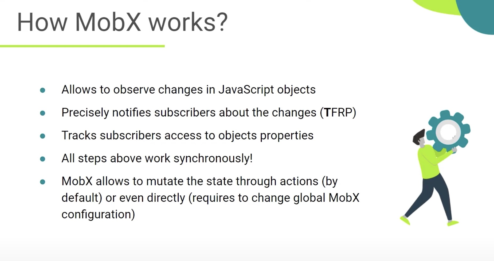
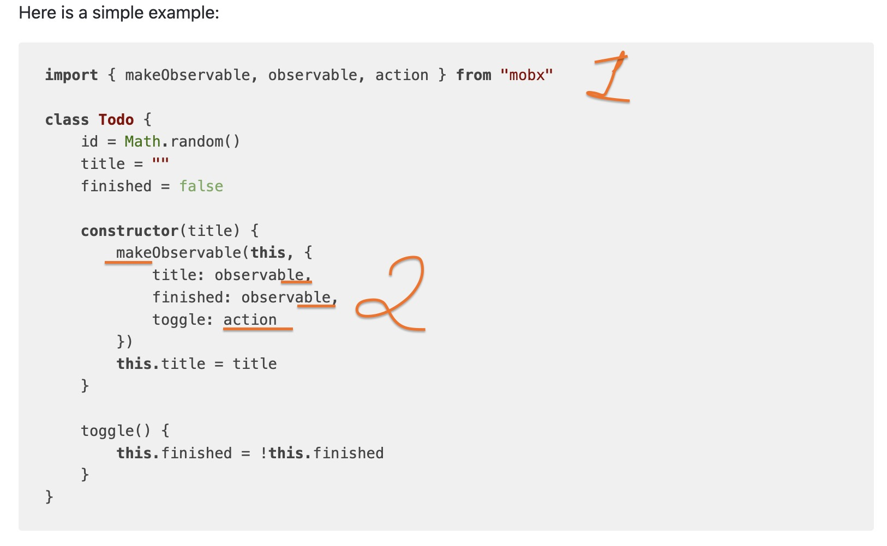
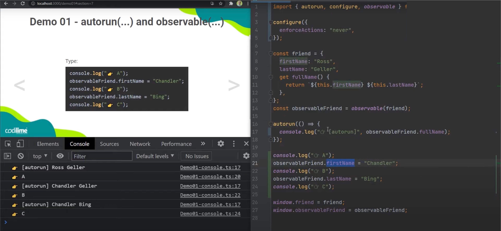
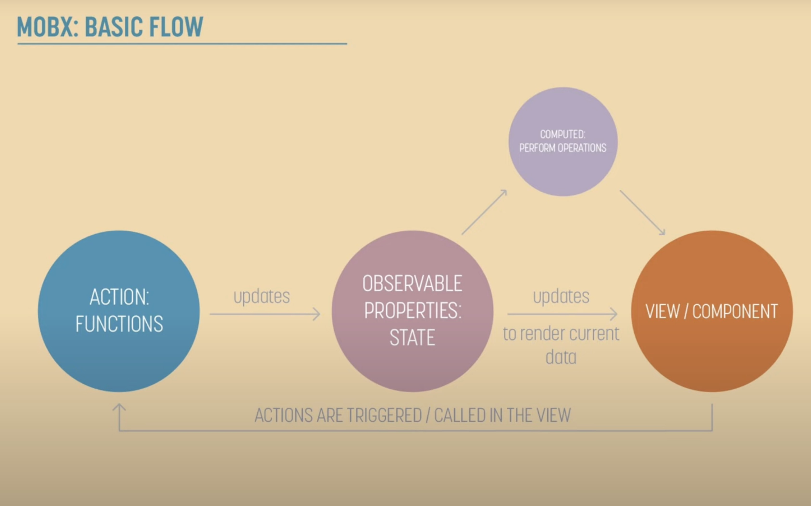

# MobX

## MobX State Management System

### What is MobX?

**Simple, scalable state management.**
**Anything that can be derived from the application state, should be. Automatically.**

MobX is a battle-tested library that makes state management simple and scalable by transparently applying functional reactive programming. The philosophy behind MobX is simple:

😙 **Straightforward**

-   Write minimalistic, boilerplate-free code that captures your intent. Trying to update a record field? Simply use a normal JavaScript assignment — the reactivity system will detect all your changes and propagate them out to where they are being used. No special tools are required when updating data in an asynchronous process.

🚅 **Effortless optimal rendering**

-   All changes to and uses of your data are tracked at runtime, building a dependency tree that captures all relations between state and output. This guarantees that computations that depend on your state, like React components, run only when strictly needed. There is no need to manually optimize components with error-prone and sub-optimal techniques like memoization and selectors.

🤹🏻‍♂️ **Architectural freedom**

-   MobX is unopinionated and allows you to manage your application state outside of any UI framework. This makes your code decoupled, portable, and above all, easily testable.

---

### Installation

`yarn add mobx mobx-react`

`npm install --save mobx mobx-react`

---

### State

**State** is the data that drives your application. State is like spreadsheet cells that hold a value.

Store state in any data structure you like: plain objects, arrays, classes, cyclic data structures or references. It doesn't matter for the workings of MobX. **Just make sure that all properties you want to change over time are marked as `observable` so MobX can track them.**

Using `observable` is like turning a property of an object into a spreadsheet cell. But unlike spreadsheets, these values can not only be primitive values, but also references, objects and arrays.

An `action` is any piece of code that changes the state. User events, backend data pushes, scheduled events, etc. An action is like a user that enters a new value into a spreadsheet cell.

---

### Configure({})

`
configure({
enforceActions: "observed" / "never" / "always"
})`

The goal of `enforceActions` is that you don't forget to wrap event handlers in action.

Possible options:

-   **"observed" (default)**: All state that is observed somewhere needs to be changed through actions. This is the default, and the recommended strictness mode in non-trivial applications.
-   **"never"**: State can be changed from anywhere.
-   **"always"**: State always needs to be changed through actions, which in practice also includes creation.
    The benefit of "observed" is that it allows you to create observables outside of actions and modify them freely, as long as they aren't used anywhere yet.

Since state should in principle always be created from some event handlers, and event handlers should be wrapped, "always" captures this the best. But you probably don't want to use this mode in unit tests.

---

### autorun(()=>{})

> The autorun function accepts one function that should run every time anything it observes changes. It also runs once when you create the autorun itself. It only responds to changes in observable state, things you have annotated observable or computed.

## We can have multiple stores in MOBX !!!
